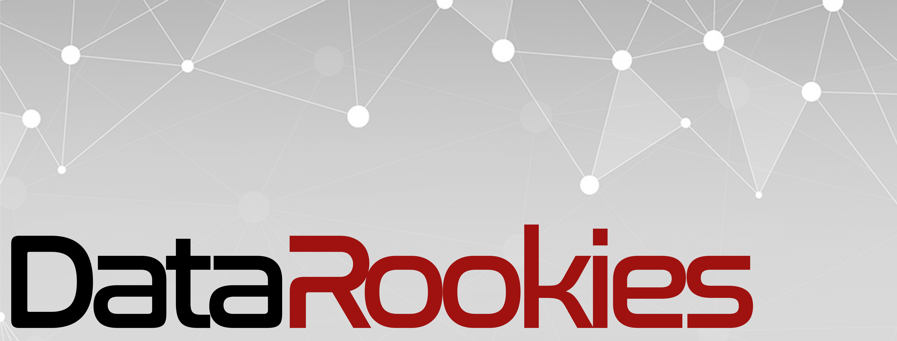

This is an evolving resource so check back time-to-time to see the latest and greatest.

## Overview

Welcome to the Learning Portal provided by the DataRookies community!  

This is one of 3 hubs where you can interact with the community:
1. **The Learning Portal (YOU ARE HERE!):** You can find links to tutorials and classes to help build your data skills.

2. [**The Facebook Page:**](fb.me/datarookies) You can get information on events - such as meetups - and community announcements (This is open to everyone!)

3. [**The Slack Community:**](https://join.slack.com/t/datarookies/shared_invite/enQtNTE0NzE5NjY0Mjc0LWMwMTA4ODAxMjU2ZmI0NjdjNmExYTdjZGJlMTQ2NDcxZDhjNzk0MThjNDUzY2VhODk3MmM4NTIyMmRmOGYwZjI) You can interact with the community, talk about anything under the Data sun, and get the latest updates.

You don't really need to visit or join everything, feel free to just join which works for you.

## The Learning Portal

This Learning Portal is an effort of the DataRookies community to help those who are starting to learn Data Science find the right resources for the right level. The portal is meant to be a collation of articles, tutorials, and other learning materials that could serve as a guide for one's learning journey.

This is an open community project, so feel free to push your own commits to this repo with updated links or better tutorials to help those who are just starting out!

Please refer to this guide (insert link) on how to contribute to this repo.

## Tutorials

In an effort to make learning Data Science less intimidating, we broke down the references into levels so that you can quickly go to the level most relevant for you.

The levels are not also strict learning flows, feel free to jump around them or cherry-pick parts to match a learning style where you feel you're learning best.

Below you can find links to the relevant level with learning materials found inside:

[Level 0: Starting from Scratch](https://github.com/aescay/DataRookies/blob/master/learning_references/Level%200:%20Starting%20from%20Scratch%20.md)

[Level 1: Coding Basics](https://github.com/aescay/DataRookies/blob/master/learning_references/Level%201:%20Coding%20Basics.md)

[Level 2: Tools for Data Science](https://github.com/aescay/DataRookies/blob/master/learning_references/Level%202:%20Tools%20for%20Data%20Science.md)

[Level 3: Managing Data Workflows](https://github.com/aescay/DataRookies/blob/master/learning_references/Level%203:%20Managing%20Data%20Workflows.md)

[Bonus 1: Complete Bootcamp Classes](https://github.com/aescay/DataRookies/blob/master/learning_references/Bonus%201:%20Complete%20Bootcamp%20Classes.md)

[Bonus 2: Competitions and Challenges](https://github.com/aescay/DataRookies/blob/master/learning_references/Bonus%202:%20Competitions%20and%20Challenges.md)

[Bonus 3: Mailing Lists and Podcasts](https://github.com/aescay/DataRookies/blob/master/learning_references/Bonus%203:%20Mailing%20Lists%20and%20Podcasts.md)

[Bonus 4: Free Resources](https://github.com/aescay/DataRookies/blob/master/learning_references/Bonus%204:%20Free%20Resources.md)

## Levels to come in the near future with your help:

None of us are specialists at the moment, and would like to ask you to contribute if you are one! Feel free to reach out to us here or on our [Facebook Page](fb.me/datarookies), or go a head and create a pull request if you want to add the resources here straight!

**Specialization 1: Machine Learning**

**Specialization 2: Data Engineering**

**Specialization 3: Data Visualization**

## Disclaimer

This project is definitely a work in progress and we would love to see your contributions in this. Our limited experience will limit the resources shown here, but with your help we can make this the hub for anyone who wants to learn Data Science related skills and tools!
